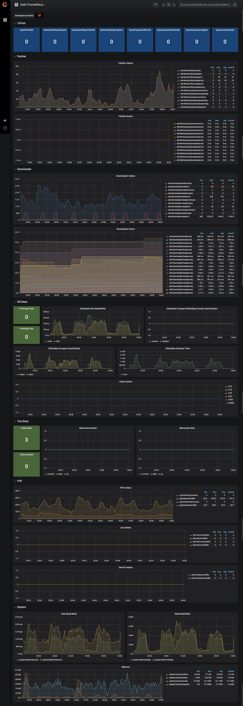

# Geth prometheus metrics

Collect and visualize [geth](https://github.com/ethereum/go-ethereum) metrics with prometheus and grafana.


Available in geth with [commit](https://github.com/ethereum/go-ethereum/commit/31bc2a2434ed29b6cd020ee712722b4b865f32e1). 
Expected release verion: `v1.9.0`
Last `chapsuk/geth:prometheus` docker image [commit](https://github.com/ethereum/go-ethereum/commit/26b50e3ebe3be197c68763e71e41926ed7df0863).

## Run example

```bash
> docker-compose up -d
```

Runs `geth --rinkeby`, prometheus and grafana.
Open [127.0.0.1:10007](http://127.0.0.1:10007) (admin:admin) for explore geth metrics dashboard.

## Dashboard



## Snapshot

See dashboard [snapshot](https://snapshot.raintank.io/dashboard/snapshot/WWFndg9Ca5Z6e5HzZ1yL3uveqhD7SvXJ).
